# `
`**MANUAL TECNICO**`
`

Universidad de San Carlos de Guatemala

Facultad de Ingeniería

Escuela de Ciencias y Sistemas

Redes de computadoras 1

Primer semestre 2024

## PRACTICA 2

- Configuración de VPCs:

  OFICINA A:
  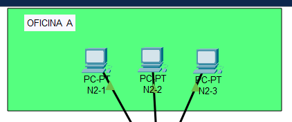
  OFICINA B:
  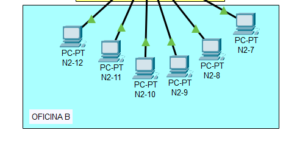
  OFICINA C:
  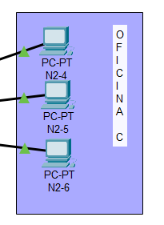
  ADMINISTACION:
  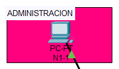
  GERENCIA:
  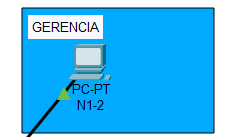
  ATENCION AL CLIENTE:
  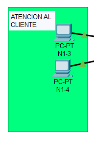
  RECURSOS HUMANOS:
  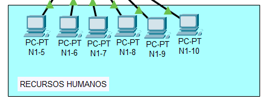
- Pings entre hosts:
  Ping entre administración y oficina C.
  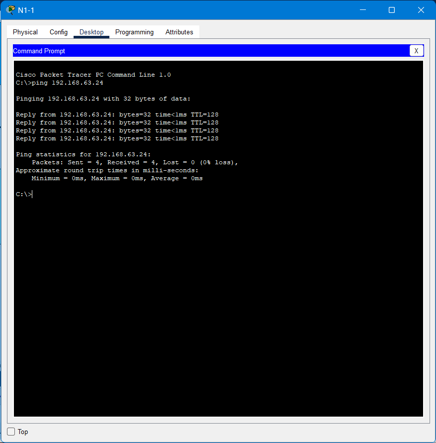
  Ping entre atención al cliente y oficina A.
  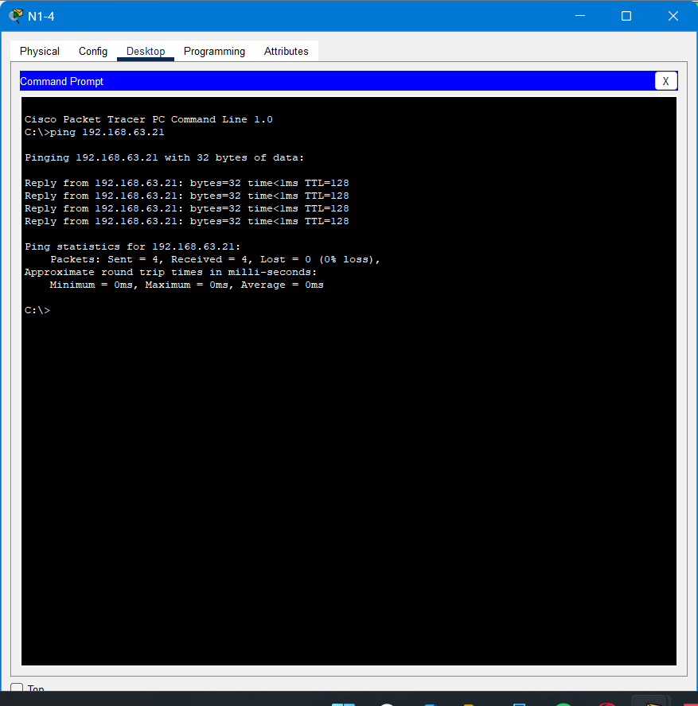
  Ping entre recursos humanos y oficina B
  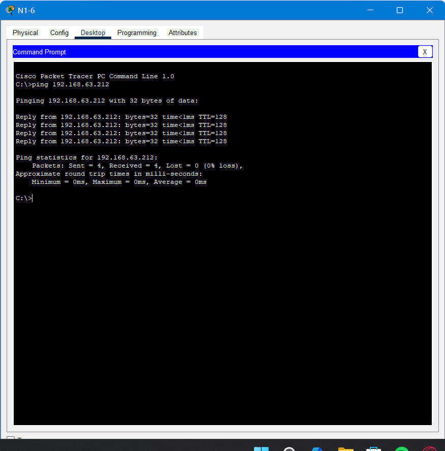
  -Simulation
  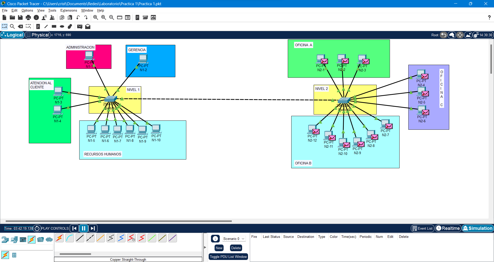
